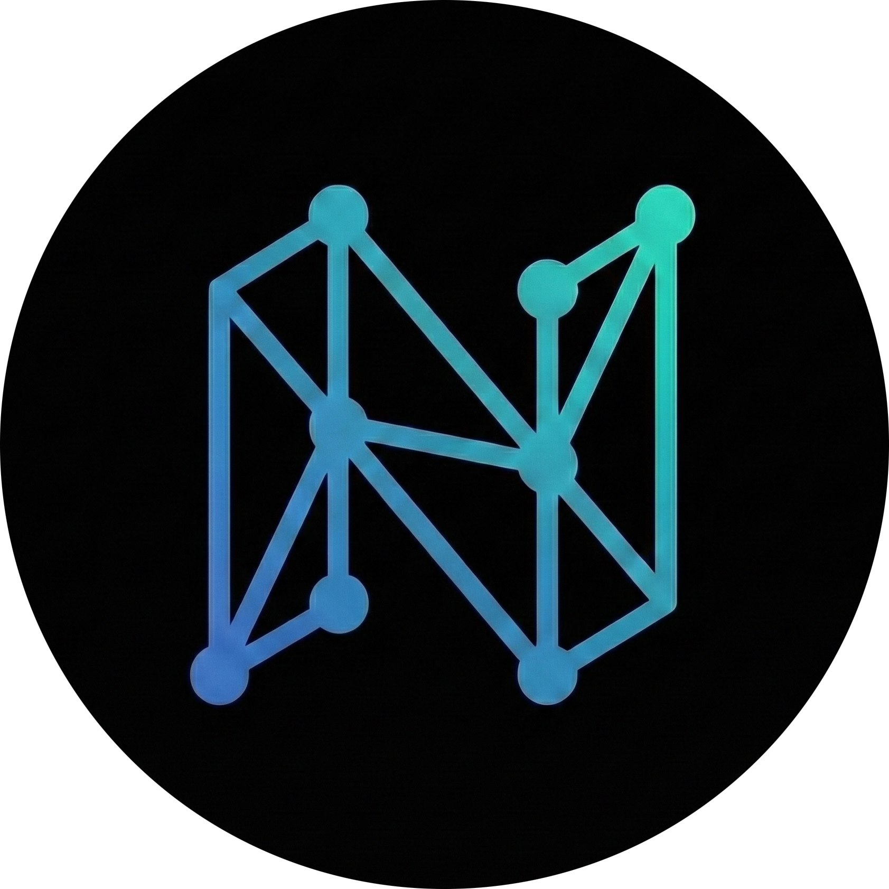

  

  # Nexus Tools
  
  **Your Ultimate Developer Toolbox Manager.**  
  *Curated. AI-Powered. Secure.*

   
   
   
  
  

  [Features](#features) • [Tech Stack](#tech-stack) • [Security](#security)

 

##  The "Dark Veil" Experience

Nexus Tools isn't just a list; it's a premium experience. Designed with the **"Dark Veil"** aesthetic, it features deep, immersive backgrounds, glassmorphism, and electric border gradients that bring your tools to life.

---

##  Features

###  **Smart Tool Management**
Organize your developer arsenal with custom categories like **AI**, **Dev**, **Design**, and **Workflow**. Pin your favorites and track subscription costs effortlessly.

###  **AI Auto-Fill (Gemini 2.0)**
Powered by **Google Gemini 2.0 Flash**. Simply paste a link, and our AI agent will:
- Identify the tool and version.
- auto-select the best category.
- writes a concise, pro-tip description.

###  **Shareable Stacks**
Create a **read-only snapshot** of your stack to share with the world. 
- Select specific tools to include.
- Generate a unique, public link.
- Keep your private notes private.

###  **Lightning Performance**
Built on **Vite 7** and **React 19**, Nexus Tools loads instantly. No layout shifts, no lag—just pure speed.

---

##  Enterprise-Grade Security

We take security seriously. Nexus Tools recently underwent a comprehensive security audit.

- **Server-Side AI Proxy**: All Gemini API calls are mediated via **Firebase Cloud Functions**. No API keys are ever exposed to the client.
- **Rate Limiting**: Intelligent backend rate limiting (10 requests/hour/user) prevents abuse.
- **Strict Validation**: **Firestore Security Rules** enforce schema validation and strict ownership.
- **Build Security**: Automated CI/CD pipelines scan every build for leaked secrets.

---

##  Tech Stack

| Component | Technology | Description |
| :--- | :--- | :--- |
| **Frontend** | React 19 + Vite 7 | The latest and greatest for UI performance. |
| **Styling** | Tailwind CSS 3.4 | Utility-first CSS with "Dark Veil" custom theme. |
| **Icons** | Lucide React | Clean, consistent, and beautiful SVG icons. |
| **Backend** | Firebase Auth & Firestore | Secure authentication and real-time database. |
| **AI** | Google Gemini 2.0 | Next-gen multimodal AI model via Vertex AI. |
| **Infrastructure** | Firebase Functions | Serverless backend for secure API proxying. |

---

  
Built with  by Lorith AI

